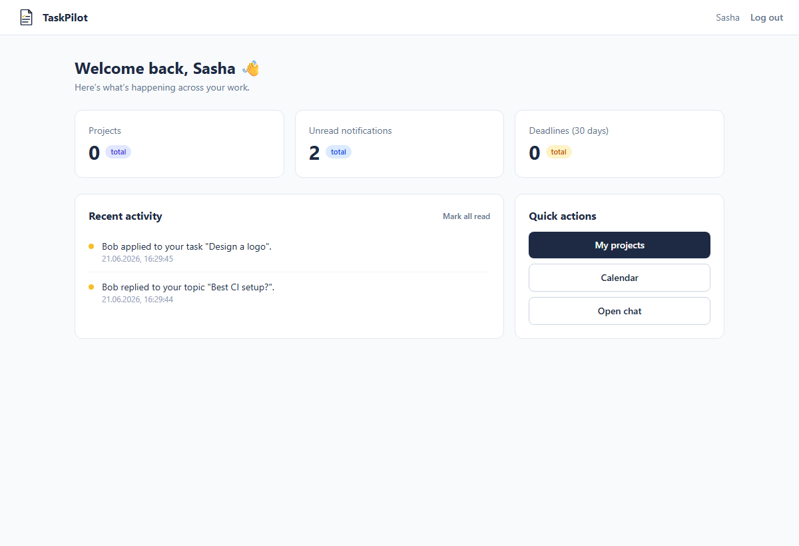
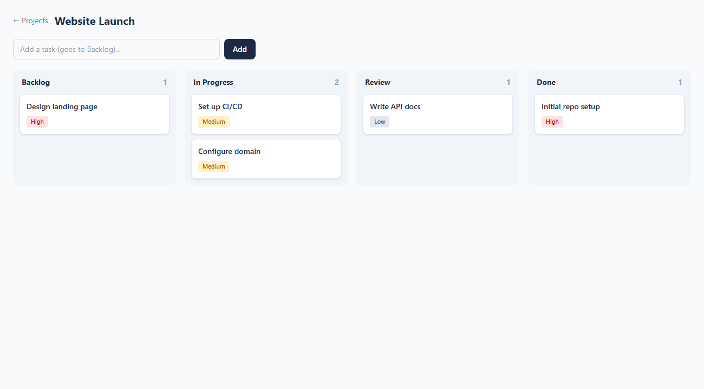
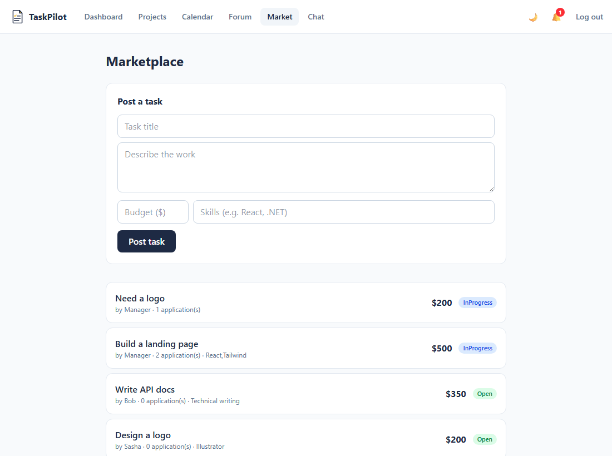
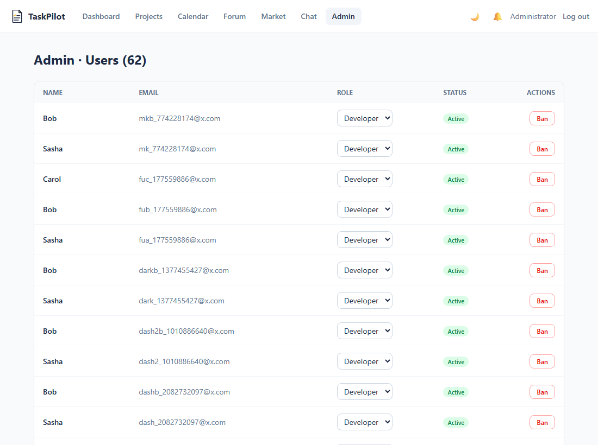
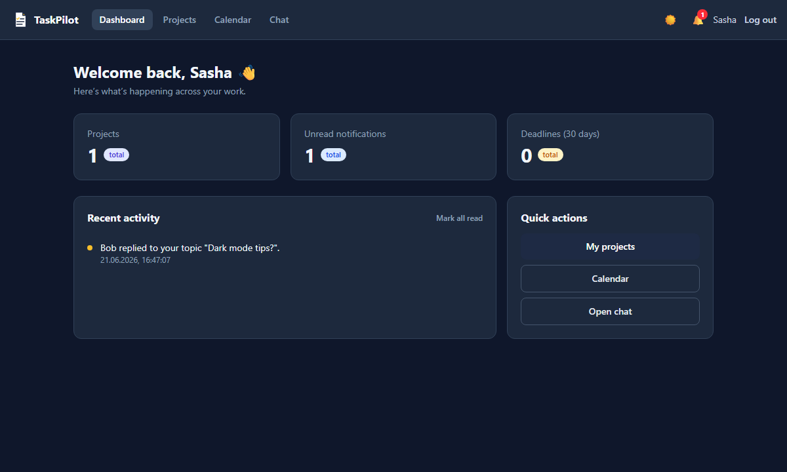

# TaskPilot

> **Your co-pilot for team productivity** — a full-stack project-management SaaS with real-time
> collaboration, an AI assistant, and real Stripe subscriptions.

<p>
  
  
  
  
  
  
  
</p>

TaskPilot is a team-collaboration platform built end-to-end as a portfolio project: projects & a
Kanban board, real-time chat, a task marketplace, a forum, calendar sync, analytics, an
AI assistant, subscription billing, and an admin/moderation area — **~30 feature modules plus a
large set of beyond-spec engineering showcases**, deployed live and backed by 670+ tests.

**→ Live demo: [task-pilot-bice.vercel.app](https://task-pilot-bice.vercel.app)** &nbsp;·&nbsp; sign up with any email, no confirmation needed.

> First load can take up to a minute — the API runs on a free instance that sleeps when idle; it's instant after it wakes.

---

## Highlights

The parts that go beyond a typical CRUD task manager:

- **⚡ Real-time collaboration (CRDT).** Two people edit a task description at the same time with
  conflict-free merging (Yjs over SignalR), plus a collaborative **sticky-note whiteboard** with
  live cursors. Text uses a pure CRDT relay; the whiteboard is an authoritative server model so
  per-note permissions (only the author/owner can delete) are actually enforced — a deliberate
  architectural split, the way Figma/Trello do it.
- **🤖 AI assistant with tool-calling.** A data-aware LLM agent that answers questions about your
  data *and takes actions* through 40+ permission-scoped tools ("create a task in Website and move
  it to In Progress"). Plus AI **"what to do next"** prioritization, **meeting-notes → tasks**
  extraction, an AI weekly digest, and subtask suggestions. Runs on a free Groq key; fully
  config-gated.
- **💳 Real Stripe subscriptions.** Self-serve Free/Pro plans via Stripe Checkout + Customer
  Portal, with the **webhook as the source of truth** (not the redirect), a failed-payment grace
  window with admin dunning alerts, monthly/annual pricing, and plan-gated features. Enterprise is
  a sales-led "Contact us" tier.
- **🔐 Passwordless sign-in (WebAuthn/passkeys)** with Face ID / Touch ID / Windows Hello, on top
  of JWT + refresh tokens, TOTP 2FA with backup codes, OAuth (Google/GitHub/LinkedIn), session
  management, API keys, an admin IP allowlist, and AES-256-GCM file encryption at rest.
- **🧩 Deep integrations.** Two-way **Google Calendar** sync, **GitHub** webhooks that link
  commits/PRs to tasks and auto-close them on merge, Telegram/Viber bots, outbound webhooks, and
  Web Push — all config-gated.
- **✅ Engineered like production.** 670+ backend unit tests, a frontend test suite, CI, Docker, a
  config-gated everything-off-by-default design, and a live free-tier deployment (Vercel + Render +
  Neon).

---

## Features

<table>
<tr><td valign="top" width="50%">

**Projects & tasks**
- Kanban board with WIP limits, filters, bulk actions
- Timeline (Gantt) with critical-path highlighting
- Sprints + story points + velocity, epics, custom fields
- Task dependencies, subtasks, recurring tasks, watchers
- Comments (reactions, editing, @mentions), attachments + version history
- Time tracking, deadline-extension requests, activity feed
- Project analytics, CSV import/export, public read-only share links

**Real-time (SignalR)**
- Chat (reactions, typing, read receipts, pin/edit, GIFs)
- Live notifications, live task comments
- Collaborative description editing (CRDT) + whiteboard + cursors

**AI (config-gated, works on free Groq)**
- Data-aware assistant with 40+ tool-calling actions
- "What to do next" prioritization, meeting notes → tasks
- Weekly digest, subtask suggestions, semantic search

</td><td valign="top" width="50%">

**Billing & plans**
- Stripe Free/Pro subscriptions (Checkout + Portal + webhooks)
- Plan gating, grace period + dunning, monthly/annual, Enterprise CTA
- Marketplace payments via Stripe

**Security & auth**
- Passkeys (WebAuthn), JWT + refresh, TOTP 2FA + backup codes
- OAuth (Google/GitHub/LinkedIn), sessions, API keys
- File encryption at rest, admin IP allowlist, rate limiting, HSTS

**Community**
- Forum (votes, accepted solution, moderation)
- Task marketplace (apply → accept → deliver → pay → review)
- Reputation, leaderboard, achievements, skill endorsements

**Platform & admin**
- PWA (installable, offline), i18n (EN/UK), dark/light + accent themes
- Command palette (⌘/Ctrl+K), in-app docs/help
- Admin: users/roles, moderation, org branding, analytics + audit log
- Notifications: email digests, quiet hours, per-project mute, Telegram/Viber/push

</td></tr>
</table>

The full 30-module specification lives in [docs/requirements.md](docs/requirements.md).

---

## Tech stack

- **Backend** — ASP.NET Core (.NET 8) Web API, EF Core 8, PostgreSQL, SignalR, JWT auth, xUnit
- **Frontend** — React 19 + TypeScript + Vite, Redux Toolkit, Tailwind CSS, Yjs (CRDT), react-i18next (EN/UK), Vitest
- **Integrations** — Stripe, Fido2NetLib (WebAuthn), OpenAI/Groq, Google Calendar, GitHub, Telegram/Viber, Web Push
- **Infrastructure** — Docker, optional Redis cache, optional RabbitMQ (notification microservice); deployed on Vercel + Render + Neon

---

## Screenshots

| Dashboard (with AI cards) | Kanban board |
| --- | --- |
|  |  |

| Collaborative whiteboard | AI assistant |
| --- | --- |
|  |  |

| Plans & billing | Task marketplace |
| --- | --- |
|  |  |

| Admin panel | Dark theme |
| --- | --- |
|  |  |

---

## Quick start with Docker

The fastest way to run the whole stack (API + frontend + PostgreSQL + Redis + RabbitMQ):

```bash
cp .env.example .env          # then edit .env and set JWT_KEY + ADMIN_PASSWORD
docker-compose up -d
```

- Frontend: http://localhost:3000
- API: http://localhost:8080
- RabbitMQ dashboard: http://localhost:15672 (guest / guest)

The frontend is served by nginx and proxies `/api` and `/hubs` to the API, so the
browser talks to a single origin (no CORS setup needed).

---

## Local development (without Docker)

### Prerequisites

- [.NET SDK 8.0](https://dotnet.microsoft.com/download) (see [global.json](global.json))
- [Node.js 20+](https://nodejs.org/)
- A PostgreSQL instance (or run just the database via `docker-compose up -d postgres`)

### 1. Backend

```bash
cd src/Taskpilot.API
cp .env.example .env          # then fill in the values (see Configuration below)
dotnet ef database update     # apply migrations (needs ConnectionStrings__DefaultConnection)
dotnet run
```

The API reads `.env` **at startup** (via DotNetEnv), so restart it after any `.env` change.
By default the `http` profile listens on **http://localhost:5025**.

An initial admin account is created/promoted on startup from the `Admin__*` values.

### 2. Frontend

```bash
cd src/Taskpilot.Frontend
cp .env.example .env          # point VITE_API_URL at the API (default http://localhost:5025)
npm install
npm run dev                   # http://localhost:5173
```

Vite only exposes variables prefixed with `VITE_`, and reads them **at startup** —
restart the dev server after editing `.env`. Never put secrets in `VITE_*`; those
values are shipped to the browser.

---

## Configuration

Secrets live only in the gitignored `.env` files (or .NET User Secrets) — never in
source control. Copy each `.env.example` to `.env` and fill in real values. .NET maps
the `__` separator to the `:` configuration hierarchy.

### Required

| Key | Where | Purpose |
| --- | --- | --- |
| `ConnectionStrings__DefaultConnection` | API | PostgreSQL connection string |
| `Jwt__Key` | API | Long random secret for signing JWTs |
| `Admin__Email` / `Admin__Password` | API | Initial admin account seeded on startup |

### Optional integrations

Every integration below is **config-gated**: leave it empty and the related feature
is simply disabled (the app still runs). Enable it by filling in the values.

| Feature | Keys (API `.env`) | Notes |
| --- | --- | --- |
| **AI assistant** | `OpenAi__ApiKey` | An OpenAI-compatible key (a free Groq key works) |
| **Stripe subscriptions** | `Stripe__SecretKey` / `ProPriceId` / `WebhookSecret` (+ optional `ProAnnualPriceId`) | See [docs/deployment.md](docs/deployment.md) |
| **Passkeys (WebAuthn)** | `Fido2__ServerDomain` / `Origins__0` | Must match the frontend domain |
| **Google sign-in / Calendar** | `GoogleOAuth__ClientId` / `ClientSecret` / `RedirectUri` + frontend `VITE_GOOGLE_CLIENT_ID` | From Google Cloud Console |
| **GitHub sign-in / integration** | `GitHubOAuth__ClientId` / `ClientSecret` + frontend `VITE_GITHUB_CLIENT_ID` | From GitHub Developer settings |
| **Email** | `Email__SmtpHost` / `SmtpPort` / `SmtpUser` / `SmtpPassword` (or `Email__ApiKey` for SendGrid) | SMTP when `SmtpHost` is set; SendGrid is the fallback |
| **Telegram bot** | `Telegram__BotToken` / `BotUsername` | Token from @BotFather |
| **Web push** | `Vapid__Subject` / `PublicKey` / `PrivateKey` | The API logs a fresh VAPID key pair at startup when empty |
| **Redis cache** | `Redis__Connection` (e.g. `localhost:6379`) | Empty = in-memory cache |

See [src/Taskpilot.API/.env.example](src/Taskpilot.API/.env.example) and
[src/Taskpilot.Frontend/.env.example](src/Taskpilot.Frontend/.env.example) for the
full list with inline notes.

### Calendar subscription

Each user gets a private, auto-updating iCal feed (Calendar → **Subscribe**). Add the
URL to Google/Apple/Outlook Calendar to keep deadlines in sync. On `localhost` use
**Export .ics** for a one-time import instead.

---

## Deployment

Free-tier hosting: PostgreSQL on **Neon**, backend on **Render**, frontend on **Vercel**
($0/month). Nothing is host-specific — Fly.io, Koyeb, Railway or a VPS work the same way.

See **[docs/deployment.md](docs/deployment.md)** for the step-by-step guide. The essentials:

- The root `Dockerfile` builds the API and honours the `PORT` a managed host injects.
- The database can be configured with a single `DATABASE_URL` (`postgresql://…`) — the app
  converts it to the form Npgsql needs. Migrations run automatically on startup.
- Set `Cors__AllowedOrigins` to the deployed frontend URL, or the browser blocks every
  request from it. `http://localhost:5173` is always allowed.
- The frontend needs `VITE_API_URL` pointing at the API (baked in at build time).

---

## Testing

```bash
# Backend unit tests (670+)
dotnet test

# Frontend type-check, tests and production build
cd src/Taskpilot.Frontend
npx tsc --noEmit
npx vitest run
npm run build
```

---

## Project structure

```
TaskPilot/
├─ src/
│  ├─ Taskpilot.API/            ASP.NET Core Web API (controllers, services, EF Core, SignalR hubs)
│  ├─ Taskpilot.Frontend/       React + TypeScript + Vite SPA
│  ├─ Taskpilot.Contracts/      Shared DTOs/messages (dependency-free)
│  ├─ Taskpilot.Integrations/   DB-free senders (email, Telegram, Viber)
│  └─ Taskpilot.NotificationService/  Worker consuming the notification queue
├─ tests/
│  └─ Taskpilot.API.Tests/      xUnit backend tests
├─ docs/                        Requirements spec, deployment guide, screenshots
├─ docker-compose.yml           Full local stack (API, frontend, Postgres, Redis, RabbitMQ)
└─ Dockerfile                   Backend API image
```

> Built and tracked in TaskPilot itself, via its GitHub integration.
